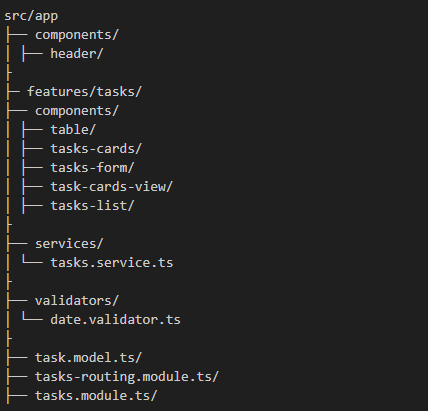

# Task Manager - Angular

## 📋 Visão Geral
Este projeto é um **gerenciador de tarefas** desenvolvido em **Angular**, com suporte para **visualização em cards** e **tabela responsiva**, permitindo:
- Criar, editar e excluir tarefas.
- Alterar status (`pendente` / `concluída`) via **checkbox**.
- Filtrar e ordenar tarefas.
- Paginação de dados.
- Interface responsiva.

---

## 🏗 Arquitetura
- **Frontend**: Angular 15+ com Angular Material.
- **Design System**: Angular Material + estilos customizados em SCSS.
- **Gerenciamento de Estado**: Local (via `@Input` / `@Output`), sem store global.
- **Serviços**: Comunicação simulada/local para manipulação de dados.
- **Estrutura de Componentes**:


---

## ⚙️ Funcionalidades
- **Cards View**: Exibição de tarefas em formato de cards, com título, descrição, status (checkbox) e data.
- **Table View**: Tabela com ordenação (`matSort`), filtro e paginação (`matPaginator`).
- **CRUD**: Criação e edição via `MatDialog`.
- **Validações**:
- Título: obrigatório, mínimo 3 caracteres.
- Descrição: obrigatória, mínimo 5 caracteres.
- Data: obrigatória, não pode ser anterior a hoje.
- Status: obrigatório.
- **Responsividade**: Layout ajusta entre cards e tabela de forma adaptável.

---

## 🚀 Instalação e Execução

### Pré-requisitos
- Node.js 18+
- Angular CLI 15+

### Passos
```bash
# Instalar dependências
npm install

# Rodar json-server
npm run start:api

# Rodar aplicação
ng serve

# Abrir no navegador
http://localhost:4200